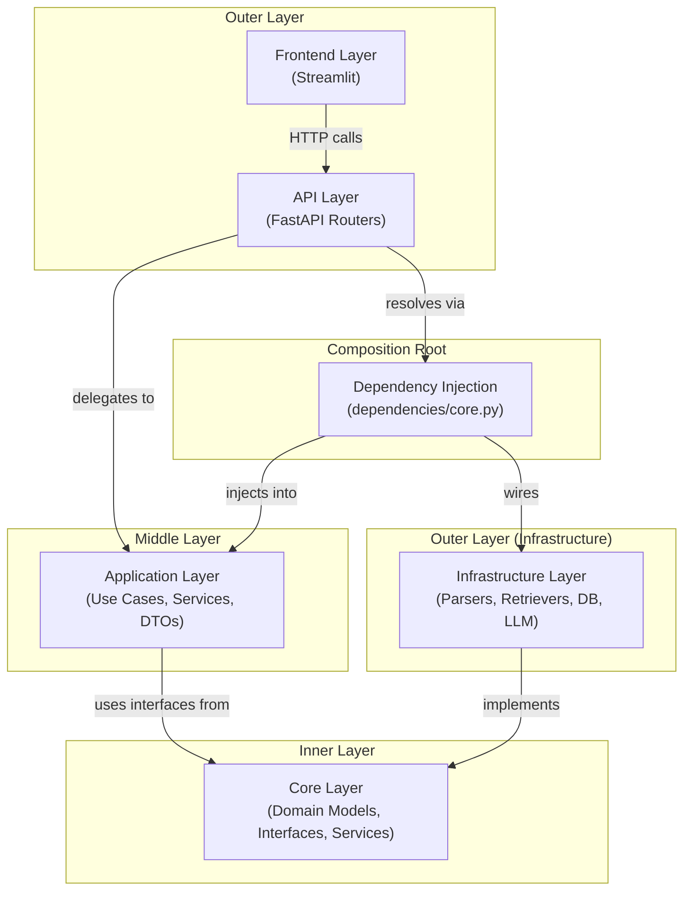
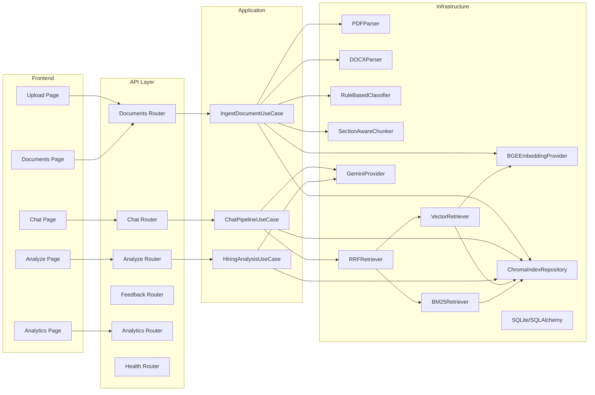
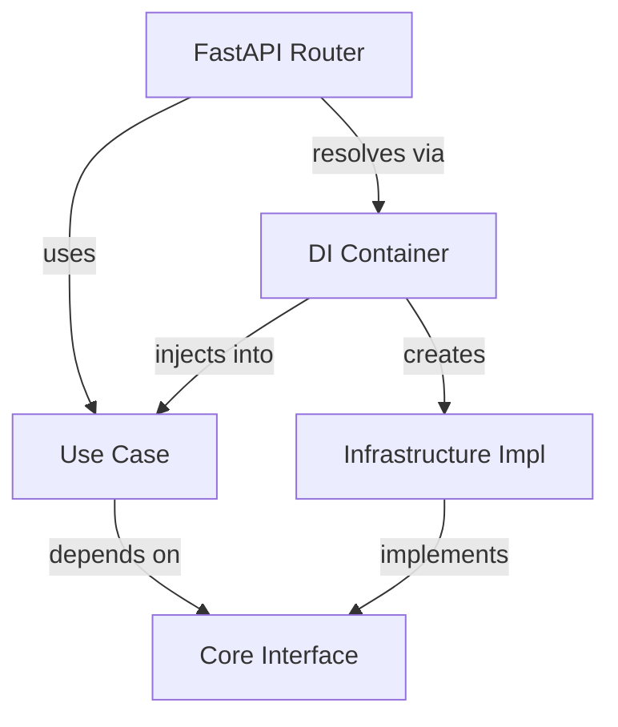
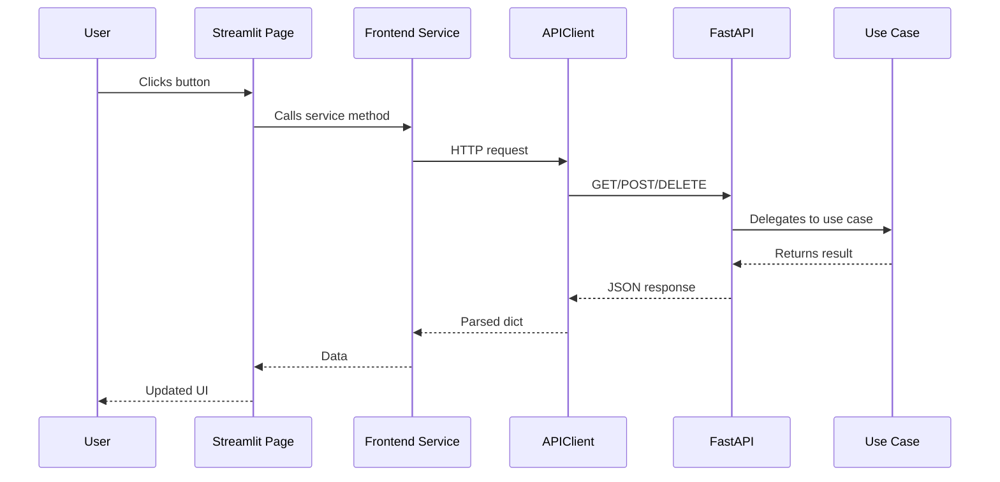

# 03 — Architecture

## Clean Architecture Overview

CogniHire implements **Clean Architecture** (Robert C. Martin) with strict dependency rules. The fundamental principle: **dependencies point inward** — outer layers depend on inner layers, never the reverse.

## Layer Responsibilities

### 1. Core Domain (`backend/core/domain/`)

| Aspect | Detail |
|--------|--------|
| **Responsibility** | Define pure business entities, value objects, and enumerations |
| **Contains** | `Document`, `ParsedDocument`, `DocumentSection`, `DocumentType`, `ClassificationResult`, `Chunk`, `ChatSession`, `ChatMessage`, `Citation` |
| **Must NOT contain** | Framework imports, database logic, API logic, I/O operations |
| **Dependencies allowed** | Python stdlib, Pydantic (for model definitions only) |
| **Dependencies prohibited** | FastAPI, SQLAlchemy, ChromaDB, LangChain, any infrastructure |
| **Directory** | `backend/core/domain/` |

### 2. Core Interfaces (`backend/core/interfaces/`)

| Aspect | Detail |
|--------|--------|
| **Responsibility** | Define abstract contracts (ABCs) that infrastructure must satisfy |
| **Contains** | `IDocumentParser`, `IDocumentClassifier`, `ISectionParser`, `IEmbedder`, `IRetriever`, `IReranker`, `ILLMProvider`, `IIndexRepository`, `IDocumentRepository`, `IChatSessionRepository` |
| **Must NOT contain** | Concrete implementations, framework-specific code |
| **Dependencies allowed** | Python stdlib, ABCs, domain models |
| **Dependencies prohibited** | Any concrete implementation |
| **Directory** | `backend/core/interfaces/` |

### 3. Core Services (`backend/core/services/`)

| Aspect | Detail |
|--------|--------|
| **Responsibility** | Cross-cutting services used across layers |
| **Contains** | `PromptManager`, `CacheService`, `EvaluationService`, `LoggingService`, `ObservabilityService` |
| **Note** | These are not pure domain services; they contain infrastructure concerns (file I/O, environment variables). In a stricter architecture, some would move to infrastructure. |
| **Directory** | `backend/core/services/` |

### 4. Application Layer (`backend/application/`)

| Aspect | Detail |
|--------|--------|
| **Responsibility** | Orchestrate business workflows by combining domain models and interface calls |
| **Contains** | Use cases (`IngestDocumentUseCase`, `ChatPipelineUseCase`, `HiringAnalysisUseCase`, `RetrieveRelevantChunksUseCase`), application services (`QueryRewriter`, `ContextBuilder`, analysis services), DTOs |
| **Must NOT contain** | HTTP handling, database queries, framework annotations |
| **Dependencies allowed** | Core domain, core interfaces, core services |
| **Dependencies prohibited** | FastAPI, SQLAlchemy ORM directly |
| **Directory** | `backend/application/` |

> **Note**: `IngestDocumentUseCase` references `SectionAwareChunker` and `MetadataExtractor` by concrete class rather than interface. This is a pragmatic decision — these classes do not have abstract interfaces defined in the current codebase.

### 5. Infrastructure Layer (`backend/infrastructure/`)

| Aspect | Detail |
|--------|--------|
| **Responsibility** | Provide concrete implementations of core interfaces |
| **Contains** | Parsers (PDF, DOCX, Section, Metadata), Classifiers (RuleBased), Chunkers (SectionAware), Embedders (BGE/Gemini), Retrievers (Vector, BM25, Hybrid, RRF), Rerankers (BGE), LLM providers (Gemini), Repositories (SQLite, Memory), Vector stores (ChromaDB), Database models and session |
| **Must NOT contain** | Business logic decisions |
| **Dependencies allowed** | Core interfaces (to implement them), core domain (for types), any framework/library |
| **Dependencies prohibited** | Other infrastructure implementations directly (except composition) |
| **Directory** | `backend/infrastructure/` |

### 6. API Layer (`backend/api/`)

| Aspect | Detail |
|--------|--------|
| **Responsibility** | Translate HTTP requests into use case calls and return HTTP responses |
| **Contains** | FastAPI routers (`documents.py`, `analyze.py`, `chat.py`, `feedback.py`, `analytics.py`, `health.py`), request/response DTOs inline |
| **Must NOT contain** | Business logic, direct database queries (except where simplified for V1) |
| **Dependencies allowed** | FastAPI, application use cases (via DI), DTOs |
| **Note** | Some API handlers directly query SQLAlchemy models (e.g., `documents.py` queries `DocumentModel`). In a stricter architecture, this would go through a repository interface. |
| **Directory** | `backend/api/` |

### 7. Dependency Injection (`backend/dependencies/core.py`)

| Aspect | Detail |
|--------|--------|
| **Responsibility** | Compose the object graph — create singletons and wire implementations into use cases |
| **Pattern** | Module-level singleton creation + factory functions for FastAPI `Depends()` |
| **Contains** | Singleton instances of all infrastructure components, factory functions (`get_ingest_document_use_case`, `get_chat_pipeline_use_case`, `get_hiring_analysis_use_case`, `get_index_repository`) |
| **Note** | This is the **only** place where concrete infrastructure classes are imported and instantiated. Use cases receive them through constructor injection. |

### 8. Frontend Layer (`frontend/`)

| Aspect | Detail |
|--------|--------|
| **Responsibility** | Render UI and handle user interaction |
| **Communication** | Exclusively through HTTP API calls via `APIClient` |
| **Contains** | Streamlit pages, service wrappers, reusable components, session state manager |
| **Must NOT contain** | Direct imports of backend modules |
| **Directory** | `frontend/` |

## Component Architecture

## Dependency Flow

**Key principle**: The `Use Case` layer never imports a concrete implementation. It only knows about the interface. The DI container (`dependencies/core.py`) handles the wiring at composition time.

## Frontend-to-Backend Communication

---

> **Next**: [Codebase Guide](04_CODEBASE_GUIDE.md)
