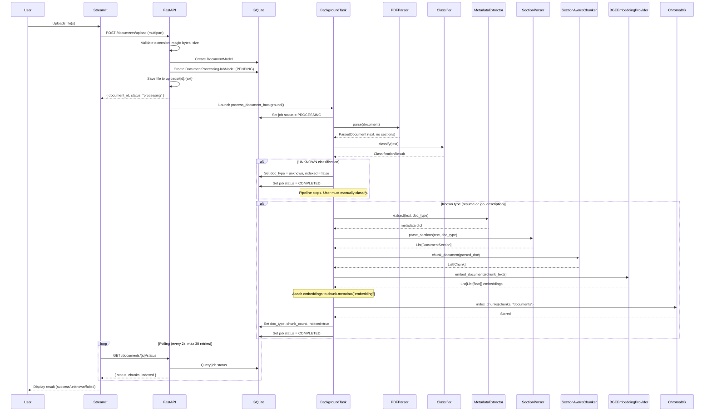
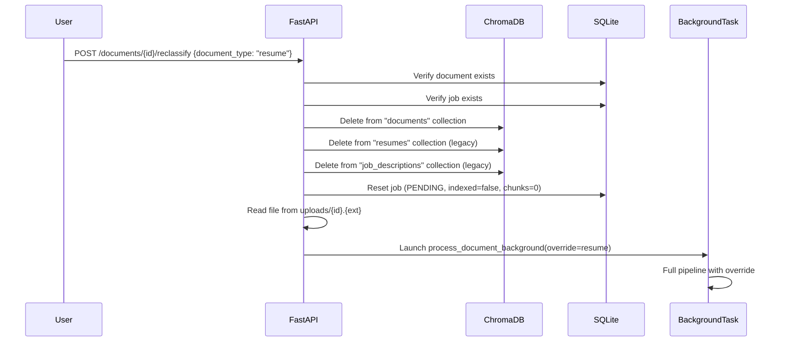

# 06 — Ingestion Pipeline

## Overview

The document ingestion pipeline transforms a raw uploaded file (PDF or DOCX) into indexed, searchable chunks stored in ChromaDB. The pipeline runs as a FastAPI **BackgroundTask** so the upload endpoint returns immediately.

## End-to-End Flow

## Pipeline Stages in Detail

### 1. File Upload and Validation

**Code**: `backend/api/documents.py` — `upload_document()`

| Step | Detail |
|------|--------|
| Extension check | Only `pdf`, `docx`, `doc` allowed (400 error otherwise) |
| Read content | `await file.read()` |
| Magic-byte check | PDF must start with `%PDF`; DOCX must start with `PK` (ZIP header) |
| Size limit | `MAX_UPLOAD_SIZE_MB` setting (default 10 MB, 413 error) |
| Generate UUID | `str(uuid.uuid4())` |
| Save to disk | `uploads/{doc_id}.{ext}` (for reclassification support) |
| Create DB records | `DocumentModel` + `DocumentProcessingJobModel` (status=PENDING) |
| Override handling | If `document_type` form field ≠ `auto`, create `DocumentType` override |

### 2. Background Processing

**Code**: `backend/api/documents.py` — `process_document_background()`

Creates a fresh `SessionLocal()` database session (required because FastAPI's request-scoped session is closed by the time the background task runs).

### 3. Parsing

**Code**: `backend/infrastructure/parsers/pdf_parser.py` or `docx_parser.py`

| Parser | Library | Process |
|--------|---------|---------|
| `PDFDocumentParser` | PyMuPDF (`fitz`) | Opens bytes stream → iterates pages → `page.get_text("text")` → adds page markers (`--- Page N ---`) → cleans whitespace |
| `DOCXDocumentParser` | python-docx | Opens bytes via `io.BytesIO` → iterates paragraphs → detects headings by style name → formats list bullets with `- ` prefix → cleans whitespace |

Both parsers return `ParsedDocument` with `doc_type=UNKNOWN` (classification happens next).

### 4. Classification

**Code**: `backend/infrastructure/classifiers/rule_based_classifier.py`

See [Classification & Parsing](07_CLASSIFICATION_AND_PARSING.md) for full details.

### 5. Override Application

If `document.doc_type_override` is set and not `UNKNOWN`, it replaces the classifier's result.

### 6. UNKNOWN Exit

If `doc_type == UNKNOWN` after override: return `(0, UNKNOWN, classification_result)`. The document is **not** indexed. The API handler sets `indexed=False` and `status=COMPLETED`.

### 7. Metadata Extraction

**Code**: `backend/infrastructure/parsers/metadata_extractor.py`

| Document Type | Extracted Fields |
|---------------|-----------------|
| Resume | `years_of_experience` (regex), `education_level` (keyword match), `candidate_name` (first non-empty line) |
| JD | `required_years_of_experience` (regex), `job_title` (first non-empty line) |

### 8. Section Detection

**Code**: `backend/infrastructure/parsers/section_parser.py`

See [Classification & Parsing](07_CLASSIFICATION_AND_PARSING.md).

### 9. Section-Aware Chunking

**Code**: `backend/infrastructure/chunkers/section_chunker.py`

See [Chunking & Embeddings](08_CHUNKING_AND_EMBEDDINGS.md).

### 10. Embedding Generation

**Code**: `backend/infrastructure/embedders/bge_embedder.py`

- Uses `GoogleGenerativeAIEmbeddings` with model `models/gemini-embedding-2`
- SHA256 cache prevents re-embedding identical texts
- Embeddings attached to `chunk.metadata["embedding"]`

### 11. ChromaDB Indexing

**Code**: `backend/infrastructure/vectorstores/chroma_repository.py`

- Collection name: `"documents"` (unified for all document types)
- Embeddings popped from metadata before storage (ChromaDB receives them separately)
- Non-string/int/float/bool metadata values are filtered out
- Uses `collection.add()` for batch insertion

### 12. Status Update

- `job.chunks_count = len(chunks)`
- `job.indexed = True`
- `job.status = ProcessingStatus.COMPLETED`
- `doc_model.doc_type = doc_type.value`
- `doc_model.classification_confidence = classification_res.confidence`
- `doc_model.classification_status = "MANUAL"` or `"AUTO"`

## Error Handling

If any exception occurs during background processing:
- `job.status = ProcessingStatus.FAILED`
- `job.error_message = str(e)`
- Full traceback printed to stdout
- Database session committed with error state

## Reclassification Flow

## Document Deletion Flow

1. Delete `DocumentProcessingJobModel` from DB
2. Delete `DocumentModel` from DB
3. Delete vectors from ChromaDB `"resumes"` collection
4. Delete vectors from ChromaDB `"job_descriptions"` collection
5. **Note**: Does not delete from `"documents"` collection (the active unified collection)
6. **Note**: Does not delete the physical file from `uploads/`

> This is a known limitation — the delete endpoint deletes from legacy collection names but not the active `"documents"` collection.

---

> **Next**: [Classification & Parsing](07_CLASSIFICATION_AND_PARSING.md)
