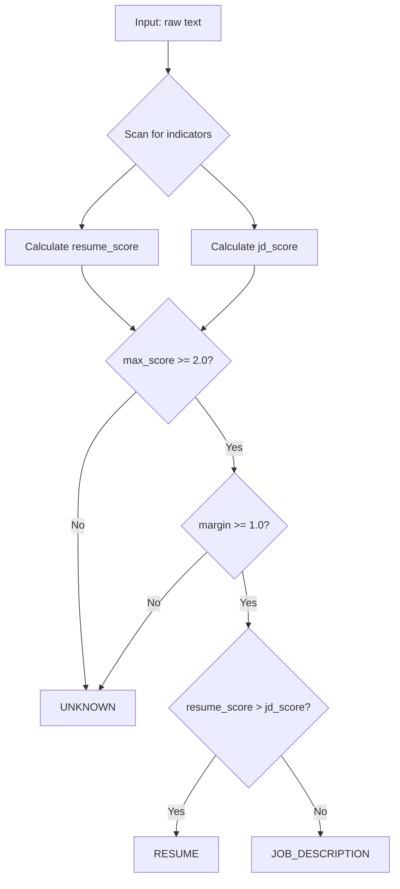

# 07 — Classification & Parsing

## Document Parsing

### PDF Parsing (`PDFDocumentParser`)

**File**: `backend/infrastructure/parsers/pdf_parser.py`  
**Interface**: `IDocumentParser`  
**Library**: PyMuPDF (`fitz`)

**Process**:
1. Opens raw bytes as a PyMuPDF document via `fitz.open(stream=doc.content, filetype="pdf")`
2. Iterates pages, appending `--- Page {n} ---` markers
3. Extracts text via `page.get_text("text")`
4. Cleans whitespace: normalizes multiple newlines, strips leading/trailing whitespace
5. Returns `ParsedDocument` with `doc_type=UNKNOWN`, text_content, and `page_count` in metadata

**Limitations**:
- No OCR — scanned PDFs yield empty text
- No table extraction — tabular data becomes unstructured text
- No image extraction

### DOCX Parsing (`DOCXDocumentParser`)

**File**: `backend/infrastructure/parsers/docx_parser.py`  
**Interface**: `IDocumentParser`  
**Library**: python-docx

**Process**:
1. Opens bytes via `docx.Document(io.BytesIO(doc.content))`
2. Iterates all paragraphs
3. Detects headings: if `para.style.name` starts with `"Heading"`, formats with `\n[Heading: {text}]\n`
4. Detects list items: if `para.style.name` starts with `"List"`, prefixes with `- `
5. Appends normal paragraph text with newlines
6. Returns `ParsedDocument` with page_count=1

**Limitations**:
- Tables, images, embedded objects ignored
- Complex formatting lost
- Always reports 1 page (no page break detection)

---

## Document Classification

### Rule-Based Classifier (`RuleBasedDocumentClassifier`)

**File**: `backend/infrastructure/classifiers/rule_based_classifier.py`  
**Interface**: `IDocumentClassifier`

The classifier uses a purely deterministic, weighted keyword-matching approach. **No LLM is involved in classification.**

### Configuration

| Parameter | Default | Purpose |
|-----------|---------|---------|
| `confidence_threshold` | 2.0 | Minimum score the winning type must achieve |
| `margin_threshold` | 1.0 | Minimum difference between resume and JD scores |

### Scoring Algorithm

```
For each indicator in the document text:
  If indicator matches (case-insensitive search):
    If STRONG indicator: add weight (2.0) to that type's score
    If WEAK indicator: add weight (0.5) to both scores
    Record in matched_indicators

classification = max_score_type
confidence = abs(resume_score - jd_score)

If max_score < confidence_threshold → UNKNOWN
If abs(resume_score - jd_score) < margin_threshold → UNKNOWN
```

### Resume Indicators (Strong, weight=2.0 each)

| Indicator | Pattern |
|-----------|---------|
| `professional summary` | Substring match |
| `career objective` | Substring match |
| `work experience` | Substring match |
| `employment history` | Substring match |
| `projects` | Substring match |
| `certifications` | Substring match |
| `contact details` | Substring match |
| `date ranges` | Regex: `\d{4}\s*[-–]\s*(?:\d{4}\|present\|current)` |
| `achievement` | Substring match |
| `email_address` | Regex: `[a-zA-Z0-9._%+-]+@[a-zA-Z0-9.-]+\.[a-zA-Z]{2,}` (weight 1.0) |

### JD Indicators (Strong, weight=2.0 each)

| Indicator | Pattern |
|-----------|---------|
| `job description` | Substring match |
| `about the role` | Substring match |
| `responsibilities` | Substring match |
| `required qualifications` | Substring match |
| `minimum qualifications` | Substring match |
| `preferred qualifications` | Substring match |
| `what you will do` | Substring match |
| `what we are looking for` | Substring match |
| `benefits` | Substring match |
| `equal opportunity employer` | Substring match |
| `apply now` | Substring match |
| `reports to` | Substring match |
| `employment type` | Substring match |
| `salary range` | Substring match |

### Weak Indicators (weight=0.5 each, added to both scores)

| Indicator |
|-----------|
| `skills` |
| `experience` |
| `education` |
| `requirements` |

### Classification Flow



---

## Section Detection

### Rule-Based Section Parser (`RuleBasedSectionParser`)

**File**: `backend/infrastructure/parsers/section_parser.py`  
**Interface**: `ISectionParser`

### Resume Section Headers

```
summary, professional summary, objective,
experience, work experience, employment history,
education, academic background,
skills, core competencies, technical skills,
projects, personal projects,
certifications, licenses,
achievements, awards, publications
```

### JD Section Headers

```
overview, about the role, about us,
responsibilities, what you'll do, duties,
requirements, qualifications, minimum qualifications, what we're looking for,
preferred qualifications, nice to have,
skills, technical skills,
benefits, perks, what we offer
```

### Detection Algorithm

1. Compile all header patterns into a single regex: `(?im)^\s*(?:pattern1|pattern2|...)\s*:?$`
2. Find all matches in the text with `re.finditer`
3. If no matches found: return single section with title "Overview" containing full text
4. Content before first match → "Header" section (usually contact info for resumes)
5. Each match → section title (`.title()` cased), content extends to next match or EOF

### Key Properties
- **Case-insensitive**: Matches `EXPERIENCE`, `Experience`, `experience`
- **Multiline**: `^` matches start of any line, not just start of string
- **Optional colon**: Handles `Skills:` and `Skills`
- **Whitespace tolerant**: Leading whitespace before headers is allowed
- **Fallback**: Unknown doc types produce single "Content" section

---

## Metadata Extraction

### MetadataExtractor

**File**: `backend/infrastructure/parsers/metadata_extractor.py`  
**No interface**: Concrete class used directly in `IngestDocumentUseCase`

### Resume Metadata

| Field | Method | Regex/Logic |
|-------|--------|-------------|
| `years_of_experience` | Regex | `(\d+)\+?\s*(?:years?\|yrs?)(?:\s+of)?\s+(?:experience\|exp)` |
| `education_level` | Keyword scan | First match from: PhD, Master, Bachelor, B.S., B.A., M.S., MBA |
| `candidate_name` | Heuristic | First non-empty line of the document |

### JD Metadata

| Field | Method | Regex/Logic |
|-------|--------|-------------|
| `required_years_of_experience` | Regex | Same pattern as resume |
| `job_title` | Heuristic | First non-empty line of the document |

### Limitations

- Name extraction is extremely fragile — takes first line regardless of actual content
- Education level detection stops at first match (may miss highest degree)
- Years of experience only captures first occurrence
- No skill extraction at metadata level

---

> **Next**: [Chunking & Embeddings](08_CHUNKING_AND_EMBEDDINGS.md)
