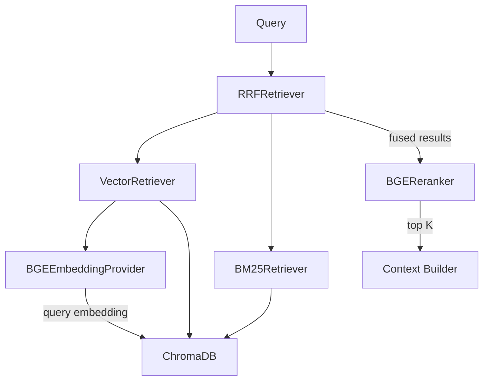
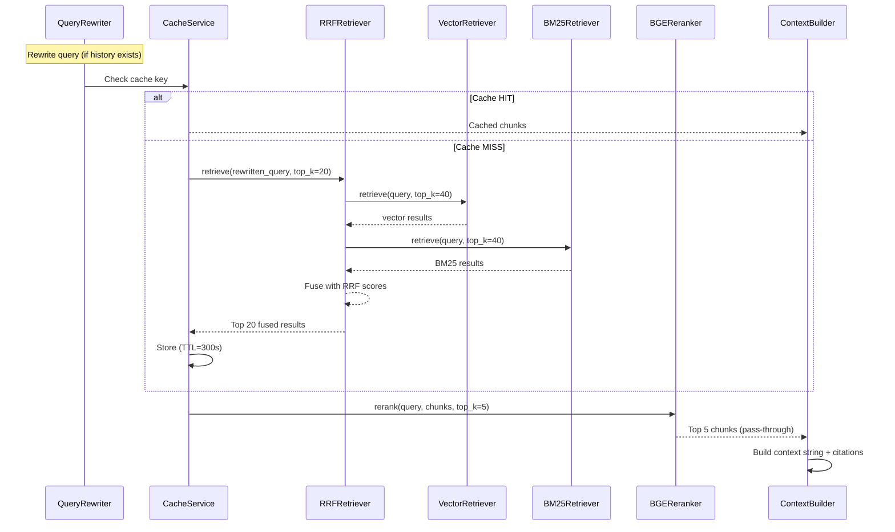

# 09 — Retrieval Pipeline

## Overview

The retrieval pipeline finds the most relevant document chunks for a user query. CogniHire implements a **hybrid retrieval** strategy that combines semantic (vector) search with lexical (BM25) search, fused via **Reciprocal Rank Fusion (RRF)**.

## Retriever Architecture



## Active Retriever: RRF (`RRFRetriever`)

**File**: `backend/infrastructure/retrievers/rrf_retriever.py`  
**Interface**: `IRetriever`  
**Status**: Active production retriever (wired in DI)

### Constructor Dependencies

| Parameter | Type | Purpose |
|-----------|------|---------|
| `vector_retriever` | `VectorRetriever` | Semantic search |
| `bm25_retriever` | `BM25Retriever` | Keyword search |
| `k` | `int` (default 60) | RRF smoothing constant |

### Algorithm

```
1. Set expanded_top_k = max(top_k * 2, 20)
2. vector_results = vector_retriever.retrieve(query, expanded_top_k, filters)
3. bm25_results = bm25_retriever.retrieve(query, expanded_top_k, filters)

4. For each chunk in vector_results at rank r:
     rrf_score += 1 / (k + r + 1)
5. For each chunk in bm25_results at rank r:
     rrf_score += 1 / (k + r + 1)

6. Sort all chunks by rrf_score descending
7. Return top_k results with rrf_score as chunk.score
```

### Properties

| Property | Value |
|----------|-------|
| RRF constant `k` | 60 (standard value from the original RRF paper) |
| Expansion factor | 2x (minimum 20) |
| Deduplication | By `chunk.id` — chunks appearing in both result sets get both rank contributions |

### Why RRF?

Vector and BM25 scores are on incompatible scales:
- Vector scores: cosine distance (typically 0.0–1.0)
- BM25 scores: unbounded term-frequency scores

RRF avoids score normalization by only using **rank positions**, making it score-agnostic and robust.

---

## Vector Retriever (`VectorRetriever`)

**File**: `backend/infrastructure/retrievers/vector_retriever.py`  
**Interface**: `IRetriever`

### Process

1. Embed query: `embedding = embedder.embed_query(query)`
2. Search ChromaDB: `index_repository.search(embedding, collection_name, top_k, filters)`
3. Return `List[Chunk]` with ChromaDB distance scores

### Score Interpretation

ChromaDB returns **distance** scores (lower = more similar). The retriever passes these through unchanged.

---

## BM25 Retriever (`BM25Retriever`)

**File**: `backend/infrastructure/retrievers/bm25_retriever.py`  
**Interface**: `IRetriever`

### Process

1. Fetch **all** chunks from collection: `index_repository.get_chunks(collection_name, filters)`
2. Tokenize all chunk texts: `text.lower().split()` (simple whitespace tokenization)
3. Build BM25Plus index: `BM25Plus(tokenized_corpus)`
4. Score query: `bm25.get_scores(tokenized_query)`
5. Filter zero-score chunks (no token overlap)
6. Sort by score descending, return top_k

### BM25Plus vs BM25Okapi

The implementation uses `BM25Plus` from the `rank_bm25` library. BM25Plus is a variant that adds a small constant (`delta=1.0`) to prevent very long documents from receiving near-zero scores. This is better suited for variable-length chunks.

### Performance Note

The BM25 retriever fetches **all chunks from the collection** on every query. For large collections, this can be slow. This is a known performance constraint of the architecture — the BM25 index is rebuilt fresh per query rather than maintained persistently.

---

## Hybrid Retriever (`HybridRetriever`)

**File**: `backend/infrastructure/retrievers/hybrid_retriever.py`  
**Interface**: `IRetriever`  
**Status**: Exists but **not wired in DI**; `RRFRetriever` is used instead

### Process

1. Run vector retrieval
2. Run BM25 retrieval
3. Interleave results (alternating)
4. Deduplicate by chunk ID (keep first occurrence)
5. Return top_k

### Why Not Used?

RRF provides mathematically superior fusion compared to simple interleaving. The `HybridRetriever` was an earlier implementation before RRF was added.

---

## BGE Reranker (`BGEReranker`)

**File**: `backend/infrastructure/rerankers/bge_reranker.py`  
**Interface**: `IReranker`  
**Status**: **Pass-through only** — does not perform actual reranking

### Current Behavior

```python
def rerank(self, query: str, chunks: List[Chunk], top_k: int = 5) -> List[Chunk]:
    return chunks[:top_k]
```

Simply returns the first `top_k` chunks without modification.

### Context

The original design planned to use a BAAI/bge-reranker-base cross-encoder model for semantic reranking. However, corporate firewall/proxy restrictions prevented downloading the model from HuggingFace. The interface is maintained and wired into DI so that a real reranker can be activated by simply replacing the implementation.

### What a Real Reranker Would Do

1. For each (query, chunk_text) pair, run through a cross-encoder model
2. Get a relevance score (0.0–1.0)
3. Sort by relevance score
4. Return top_k

This would significantly improve precision by using a more computationally expensive but accurate model to re-evaluate the top retrieval results.

---

## Retrieval in Chat Pipeline



### Cache Behavior

| Aspect | Detail |
|--------|--------|
| Key format | `retrieve_{rewritten_query}_{collection_name}` |
| TTL | 300 seconds (5 minutes) |
| Storage | In-memory dictionary |
| Scope | Process-level |
| Effect | Identical queries within 5 minutes skip retrieval entirely |

---

## Retrieval in Hiring Analysis

The hiring analysis pipeline uses a **different retrieval path** than chat:

1. Calls `IIndexRepository.get_chunks()` directly (not through IRetriever)
2. Uses `$and` metadata filters to fetch **all** chunks for a specific document_id and document_type
3. Does not use vector similarity — retrieves by exact metadata match
4. Passes all matching chunks to `ContextBuilder`

This makes sense because analysis needs the **complete** document context, not just query-relevant chunks.

---

> **Next**: [RAG & Chat Pipeline](10_RAG_AND_CHAT_PIPELINE.md)
