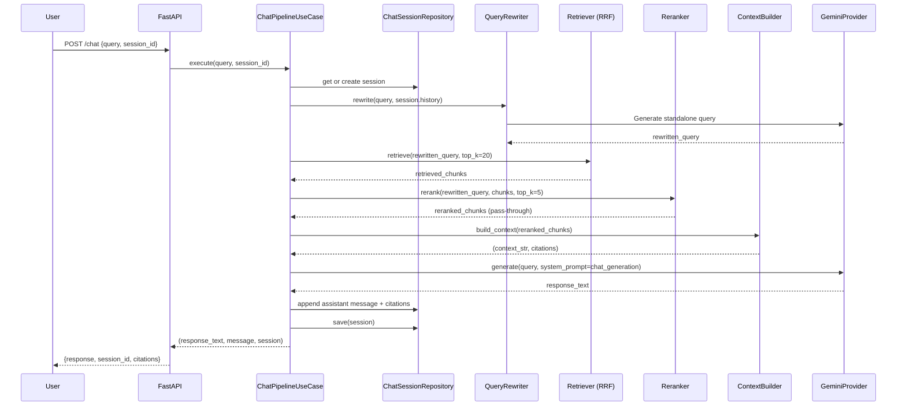

# 10 — RAG & Chat Pipeline

## Overview

The chat pipeline enables recruiters to ask open-ended questions about documents stored in the system. It implements an advanced **Retrieval-Augmented Generation (RAG)** architecture with query rewriting, hybrid retrieval, and citation tracking.

## End-to-End Chat Flow



## Session Management

**Interface**: `IChatSessionRepository`  
**Implementation**: `MemoryChatSessionRepository`

### Behavior
- In-memory dictionary mapped by UUID strings
- Sessions are completely lost when the FastAPI process restarts
- A new session ID is generated and returned on the first request if not provided
- Stores full message history (user and assistant alternating)
- Stores rewritten queries for debugging

### Limitation
The memory repository is suitable for V1 but must be replaced with a database-backed repository (e.g., PostgreSQL/Redis) for horizontal scaling or persistence.

## Query Rewriting

**Class**: `QueryRewriter`

Users often ask follow-up questions containing pronouns (e.g., "What about his education?"). Retrieval systems perform poorly on such queries. The `QueryRewriter` converts them into standalone queries.

1. **Trigger**: Only runs if `session.history` is not empty.
2. **Input**: Last 5 messages + new user query.
3. **Prompt**: `query_rewriter` (from `prompts.json`).
4. **LLM Call**: Gemini generates the rewritten query.
5. **Output**: Used exclusively for retrieval (the LLM still answers the original user query).

## Context Construction

**Class**: `ContextBuilder`

Transforms a list of `Chunk` objects into a single string optimized for the LLM.

### Output Format
```
Source: [Resume | Experience | Page None | Chunk 0]
Content:
Senior Software Engineer at Google. Led team of 5 engineers.

---
Source: [Resume | Education | Page None | Chunk 3]
Content:
B.S. in Computer Science, MIT.
```

### Citation Tracking
For every chunk included in the context, a `Citation` object is created and returned alongside the string. This allows the backend to attach structured citations to the assistant's message.

## Generation (Gemini)

**Class**: `GeminiProvider`

### Configuration
| Setting | Source |
|---------|--------|
| Model | `settings.GEMINI_MODEL` |
| Temperature | `settings.GEMINI_TEMPERATURE` (default: 0.2 - low temp for factual RAG) |
| Max Tokens | `settings.GEMINI_MAX_TOKENS` |

### Prompt
The `chat_generation` prompt explicitly instructs: "Answer the user's question based ONLY on the provided context. If the answer is not in the context, state that you don't know."

## Streaming Chat

**Endpoint**: `POST /api/v1/chat/stream`  
**Use Case Method**: `ChatPipelineUseCase.execute_stream()`

### Implementation
- Uses Server-Sent Events (SSE) via FastAPI's `StreamingResponse`
- Yields tokens directly from `GeminiProvider.stream()`
- Same pipeline (rewriting, retrieval, reranking, context building) runs synchronously *before* the stream begins

### Limitations
- The current implementation yields raw text chunks. It does not yield a structured JSON event stream, meaning the frontend cannot easily receive the generated `session_id` or `citations` list in real-time.
- The frontend falls back to saving just the text or running synchronous chat if citations are required.

## Post-Chat Processing

After generating a response, the API route schedules a **BackgroundTask**:

```python
background_tasks.add_task(
    eval_service.evaluate_response,
    query=request.query,
    answer=response_text,
    contexts=contexts,
    session_id=session.session_id
)
```

This triggers the RAGAS evaluation pipeline (currently mocked) to assess the quality of the generated response asynchronously.

---

> **Next**: [Hiring Intelligence](11_HIRING_INTELLIGENCE.md)
