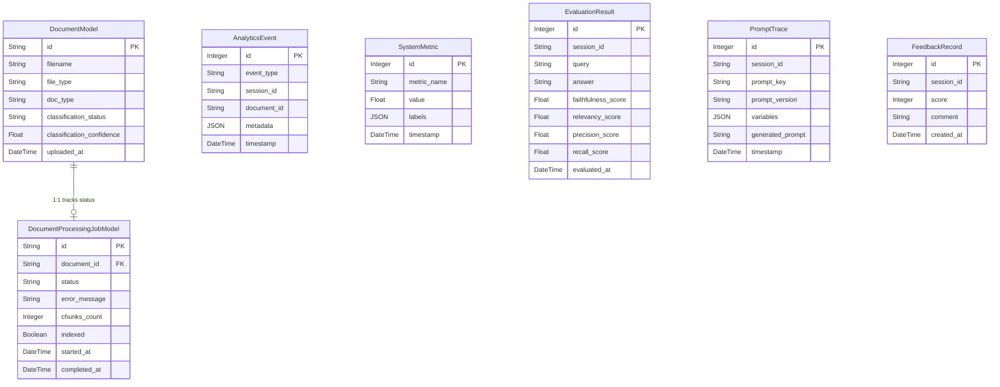

# 13 — Database Reference

CogniHire uses **SQLite** (via SQLAlchemy ORM) for relational data persistence. 
Vector data is stored separately in ChromaDB.

**File**: `backend/infrastructure/database/models.py`

## Entity-Relationship Overview

## Tables

### 1. `documents` (DocumentModel)
Core record for an uploaded file.

| Column | Type | Constraints | Description |
|--------|------|-------------|-------------|
| `id` | String | Primary Key | UUID |
| `filename` | String | Not Null | Original filename |
| `file_type` | String | Not Null | Extension (`pdf`, `docx`) |
| `doc_type` | String | Default `unknown` | Classified type (`resume`, `job_description`, `unknown`) |
| `classification_status` | String | Default `AUTO` | `AUTO` or `MANUAL` (if overridden) |
| `classification_confidence` | Float | Nullable | Score delta from classifier |
| `uploaded_at` | DateTime | Default `utcnow` | |

### 2. `document_processing_jobs` (DocumentProcessingJobModel)
Tracks the state of the background ingestion pipeline.

| Column | Type | Constraints | Description |
|--------|------|-------------|-------------|
| `id` | String | Primary Key | UUID |
| `document_id` | String | FK(`documents.id`) | Links to document |
| `status` | Enum | Default `PENDING` | `PENDING`, `PROCESSING`, `COMPLETED`, `FAILED` |
| `error_message` | String | Nullable | Exception traceback if failed |
| `chunks_count` | Integer | Default 0 | Number of chunks generated |
| `indexed` | Boolean | Default False | True if successfully stored in ChromaDB |
| `started_at` | DateTime | Default `utcnow` | |
| `completed_at` | DateTime | Nullable | Populated on terminal state |

### 3. `analytics_events` (AnalyticsEvent)
Records user actions and system events.

| Column | Type | Description |
|--------|------|-------------|
| `id` | Integer | Auto-increment PK |
| `event_type` | String (Indexed) | e.g., "document_upload", "chat_query" |
| `session_id` | String | Optional linkage to chat session |
| `document_id` | String | Optional linkage to document |
| `event_metadata`| JSON | Arbitrary event data |
| `timestamp` | DateTime | |

### 4. `system_metrics` (SystemMetric)
Records performance metrics like latency.

| Column | Type | Description |
|--------|------|-------------|
| `id` | Integer | Auto-increment PK |
| `metric_name` | String (Indexed) | e.g., "retrieval_latency_ms" |
| `value` | Float | Metric value |
| `labels` | JSON | Dimensions (e.g., `{"retriever": "RRF"}`) |
| `timestamp` | DateTime | |

### 5. `evaluation_results` (EvaluationResult)
Stores RAGAS evaluation scores for chat responses.

| Column | Type | Description |
|--------|------|-------------|
| `id` | Integer | Auto-increment PK |
| `session_id` | String (Indexed) | Links to chat session |
| `query` | Text | Original user query |
| `answer` | Text | Generated answer |
| `faithfulness_score` | Float | RAGAS score |
| `relevancy_score` | Float | RAGAS score |
| `precision_score` | Float | RAGAS score |
| `recall_score` | Float | RAGAS score |
| `evaluated_at` | DateTime | |

### 6. `prompt_traces` (PromptTrace)
Records exactly what prompt was sent to the LLM (useful for debugging before LangSmith was added).

| Column | Type | Description |
|--------|------|-------------|
| `id` | Integer | Auto-increment PK |
| `session_id` | String | Links to chat session |
| `prompt_key` | String | e.g., `chat_generation` |
| `prompt_version` | String | e.g., `1.0` |
| `variables` | JSON | Variables injected into template |
| `generated_prompt`| Text | The final rendered prompt string |
| `timestamp` | DateTime | |

### 7. `feedback_records` (FeedbackRecord)
Stores user feedback on chat responses.

| Column | Type | Description |
|--------|------|-------------|
| `id` | Integer | Auto-increment PK |
| `session_id` | String (Indexed) | Links to chat session |
| `score` | Integer | 1-5 rating |
| `comment` | Text | Optional user comment |
| `created_at` | DateTime | |

---

> **Next**: [Frontend Guide](14_FRONTEND_GUIDE.md)
