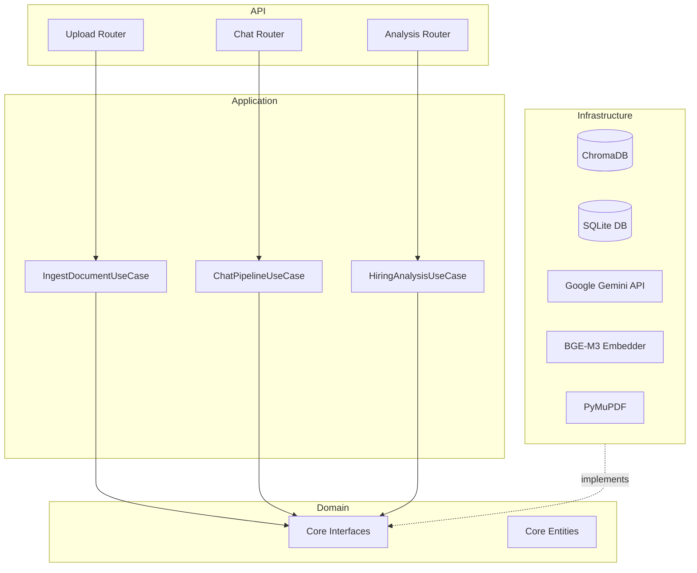
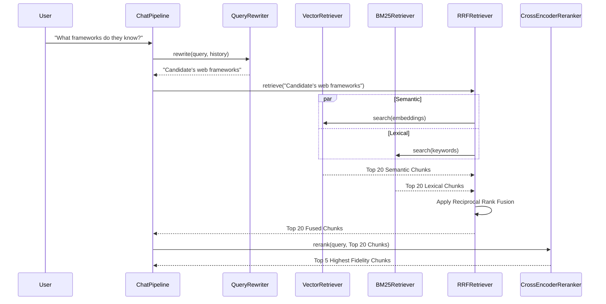
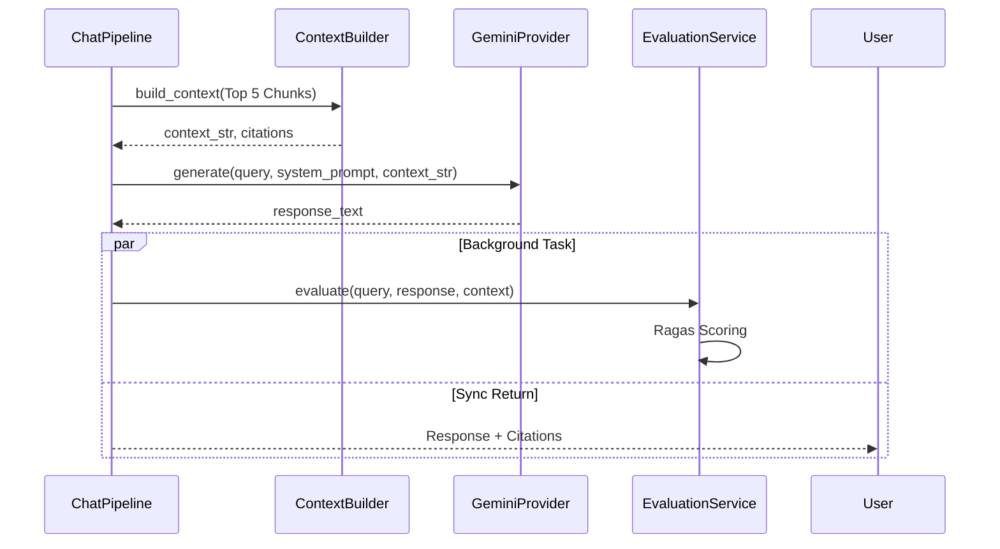

# CogniHire Architecture

CogniHire utilizes a Clean Architecture approach to strictly separate concerns, ensuring maximum maintainability and testability.

## Clean Architecture Layers

## Retrieval Pipeline

## RAG Pipeline

