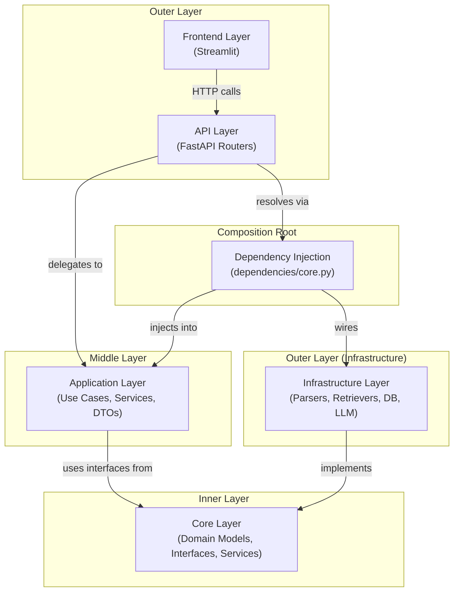

# Architecture Diagram

```mermaid
graph TB
    subgraph "Outer Layer"
        API["API Layer<br/>(FastAPI Routers)"]
        FE["Frontend Layer<br/>(Streamlit)"]
    end
    subgraph "Middle Layer"
        APP["Application Layer<br/>(Use Cases, Services, DTOs)"]
    end
    subgraph "Inner Layer"
        CORE["Core Layer<br/>(Domain Models, Interfaces, Services)"]
    end
    subgraph "Outer Layer (Infrastructure)"
        INFRA["Infrastructure Layer<br/>(Parsers, Retrievers, DB, LLM)"]
    end
    subgraph "Composition Root"
        DI["Dependency Injection<br/>(dependencies/core.py)"]
    end

    FE -->|HTTP calls| API
    API -->|delegates to| APP
    APP -->|uses interfaces from| CORE
    INFRA -->|implements| CORE
    DI -->|wires| INFRA
    DI -->|injects into| APP
    API -->|resolves via| DI
```
