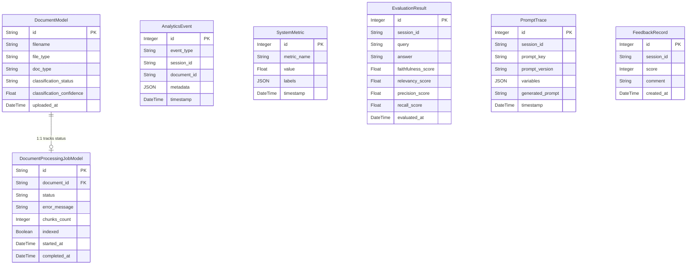

# Database Entity-Relationship Diagram

```mermaid
erDiagram
    DocumentModel ||--o| DocumentProcessingJobModel : "1:1 tracks status"
    DocumentModel {
        String id PK
        String filename
        String file_type
        String doc_type
        String classification_status
        Float classification_confidence
        DateTime uploaded_at
    }
    
    DocumentProcessingJobModel {
        String id PK
        String document_id FK
        String status
        String error_message
        Integer chunks_count
        Boolean indexed
        DateTime started_at
        DateTime completed_at
    }

    AnalyticsEvent {
        Integer id PK
        String event_type
        String session_id
        String document_id
        JSON metadata
        DateTime timestamp
    }

    SystemMetric {
        Integer id PK
        String metric_name
        Float value
        JSON labels
        DateTime timestamp
    }

    EvaluationResult {
        Integer id PK
        String session_id
        String query
        String answer
        Float faithfulness_score
        Float relevancy_score
        Float precision_score
        Float recall_score
        DateTime evaluated_at
    }

    PromptTrace {
        Integer id PK
        String session_id
        String prompt_key
        String prompt_version
        JSON variables
        String generated_prompt
        DateTime timestamp
    }

    FeedbackRecord {
        Integer id PK
        String session_id
        Integer score
        String comment
        DateTime created_at
    }
```
