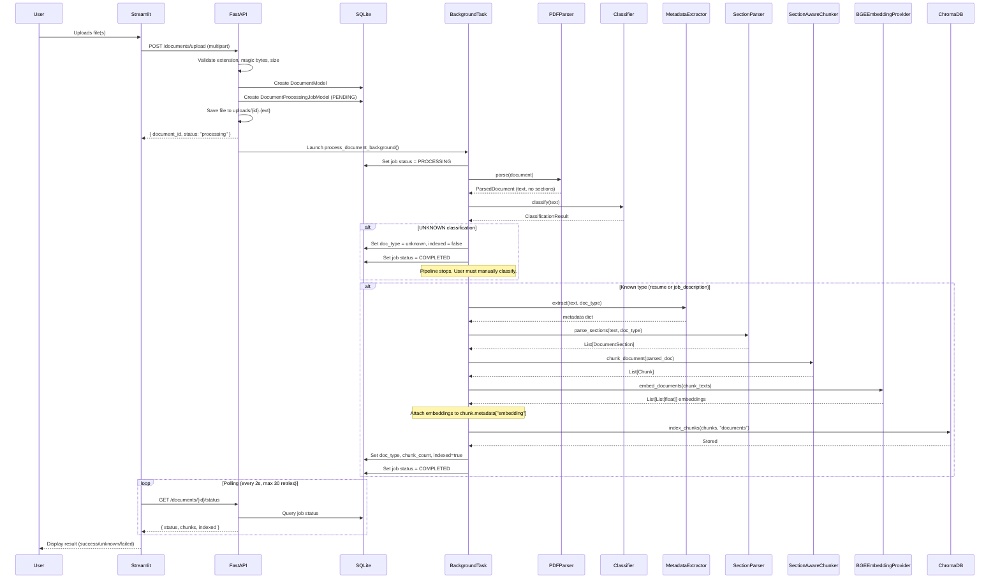

# Ingestion Sequence Diagram

```mermaid
sequenceDiagram
    participant U as User
    participant ST as Streamlit
    participant API as FastAPI
    participant DB as SQLite
    participant BG as BackgroundTask
    participant PDF as PDFParser
    participant CLS as Classifier
    participant META as MetadataExtractor
    participant SEC as SectionParser
    participant CHK as SectionAwareChunker
    participant EMB as BGEEmbeddingProvider
    participant CHROMA as ChromaDB

    U->>ST: Uploads file(s)
    ST->>API: POST /documents/upload (multipart)
    API->>API: Validate extension, magic bytes, size
    API->>DB: Create DocumentModel
    API->>DB: Create DocumentProcessingJobModel (PENDING)
    API->>API: Save file to uploads/{id}.{ext}
    API-->>ST: { document_id, status: "processing" }
    API->>BG: Launch process_document_background()

    BG->>DB: Set job status = PROCESSING
    BG->>PDF: parse(document)
    PDF-->>BG: ParsedDocument (text, no sections)

    BG->>CLS: classify(text)
    CLS-->>BG: ClassificationResult

    alt UNKNOWN classification
        BG->>DB: Set doc_type = unknown, indexed = false
        BG->>DB: Set job status = COMPLETED
        Note over BG: Pipeline stops. User must manually classify.
    end

    alt Known type (resume or job_description)
        BG->>META: extract(text, doc_type)
        META-->>BG: metadata dict

        BG->>SEC: parse_sections(text, doc_type)
        SEC-->>BG: List[DocumentSection]

        BG->>CHK: chunk_document(parsed_doc)
        CHK-->>BG: List[Chunk]

        BG->>EMB: embed_documents(chunk_texts)
        EMB-->>BG: List[List[float]] embeddings

        Note over BG: Attach embeddings to chunk.metadata["embedding"]

        BG->>CHROMA: index_chunks(chunks, "documents")
        CHROMA-->>BG: Stored

        BG->>DB: Set doc_type, chunk_count, indexed=true
        BG->>DB: Set job status = COMPLETED
    end

    loop Polling (every 2s, max 30 retries)
        ST->>API: GET /documents/{id}/status
        API->>DB: Query job status
        API-->>ST: { status, chunks, indexed }
    end

    ST-->>U: Display result (success/unknown/failed)
```
