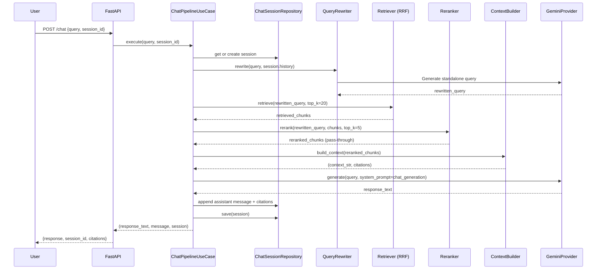

# RAG Sequence Diagram

```mermaid
sequenceDiagram
    participant U as User
    participant API as FastAPI
    participant UC as ChatPipelineUseCase
    participant SESS as ChatSessionRepository
    participant QR as QueryRewriter
    participant RET as Retriever (RRF)
    participant RR as Reranker
    participant CTX as ContextBuilder
    participant LLM as GeminiProvider

    U->>API: POST /chat {query, session_id}
    API->>UC: execute(query, session_id)
    
    UC->>SESS: get or create session
    
    UC->>QR: rewrite(query, session.history)
    QR->>LLM: Generate standalone query
    LLM-->>QR: rewritten_query
    
    UC->>RET: retrieve(rewritten_query, top_k=20)
    RET-->>UC: retrieved_chunks
    
    UC->>RR: rerank(rewritten_query, chunks, top_k=5)
    RR-->>UC: reranked_chunks (pass-through)
    
    UC->>CTX: build_context(reranked_chunks)
    CTX-->>UC: (context_str, citations)
    
    UC->>LLM: generate(query, system_prompt=chat_generation)
    LLM-->>UC: response_text
    
    UC->>SESS: append assistant message + citations
    UC->>SESS: save(session)
    
    UC-->>API: (response_text, message, session)
    API-->>U: {response, session_id, citations}
```
